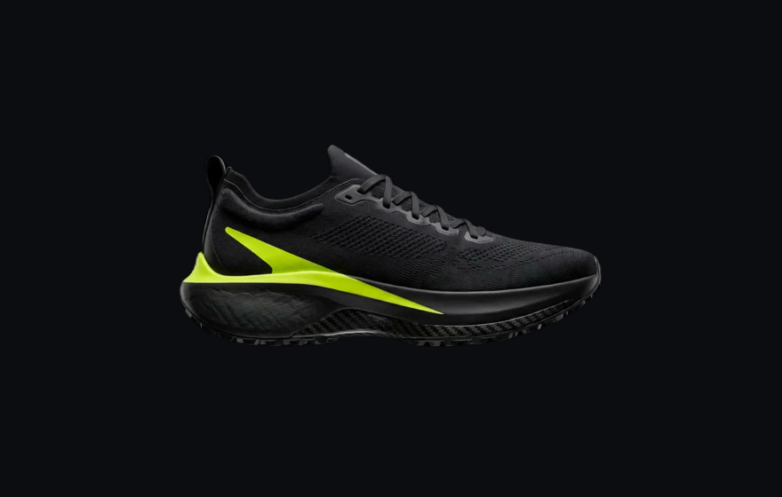
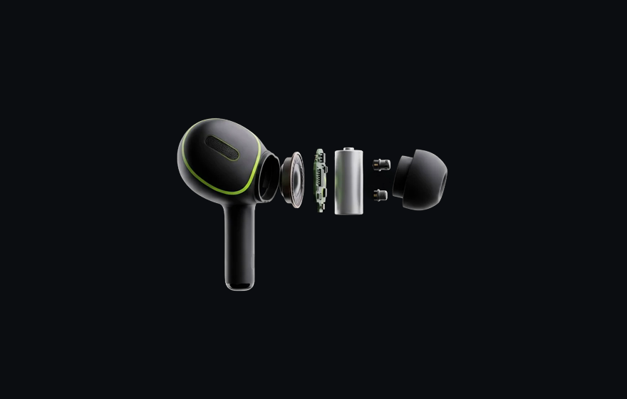
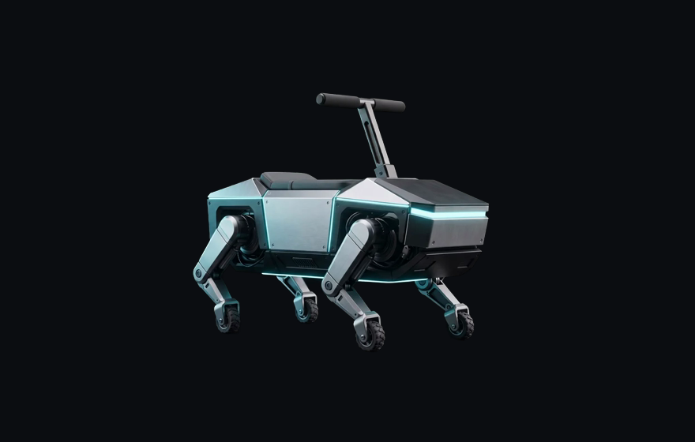

# 3D Webpage Kit

Build premium, **Apple-style scroll-scrubbed 3D product pages** with Claude Code — the whole
thing generated from a prompt. No photographer, no designer, no 3D software. Plain HTML/CSS/JS,
no build step, deploy free. Claude directs kie.ai (any AI image/video model) to make the product
visuals and the scroll animation.

### ▶ See it live — scroll all three
### **https://3d-webpage-kit.cal-272.workers.dev**

|  |  |  |
|:---:|:---:|:---:|
| **VELO** · side-profile turntable | **PULSE** · exploded-engineering + live part labels | **Huriza** · a real product, built with the kit |

The first two ship in this repo as `pages/`; Huriza is a real brand built with the kit.

The kit gives Claude three things most people never give it — which is why pages
come out looking *designed* instead of like generic AI slop:
1. **A design system it reads** (`brand/tokens.css`) so every page is on-brand.
2. **Reusable sections** (`sections/`) so structure stays consistent.
3. **The scroll-hero pipeline** — generate → matte → scrub — encoded as a skill.

## Quickstart

1. **Open this folder in Claude Code** (`cd webpage-starter-kit && claude`).
2. **Add your keys:** copy `.env.example` → `.env`. You need a Cloudflare token to
   deploy; add a kie.ai key too if you want the AI hero animation. Full steps: **`SETUP.md`**.
3. **Make it yours:** say *"set my brand"* — Claude sets your accent color, fonts, and
   voice in one place (`brand-setup`).
4. **Build a page:** say
   > build me a landing page for my <product>, with a scroll-animated hero
   Claude reads your brand, runs `scroll-hero` (storyboard → generate → matte → wire),
   assembles the page from `sections/`, and tests it locally.
5. **Ship it:** say *"deploy this"* — live on Cloudflare in a minute (`launch`).

> Just want pages, no AI animation? Skip the kie key. Everything except the animated
> hero works with only a Cloudflare token (or any static host).

## What's inside
- `brand/` — your design system (`tokens.css`) + voice (`brand.md`)
- `sections/` — hero, features, specs, CTA, footer …
- `assets/` — the scroll engine (`scroll-sequence.js/.css`) + base styles + generated frames
- `scripts/kie.sh` — a tiny kie.ai REST wrapper (no MCP needed)
- `.claude/skills/` — `scroll-hero`, `build-page`, `brand-setup`, `launch`, `design-intelligence`
- `SETUP.md` — keys + tools · `deploy.md` — going live

## Requirements
- Claude Code on a paid Anthropic plan.
- **To deploy:** a free Cloudflare account + token (or any static host). See `SETUP.md`.
- **For the AI hero (optional):** a kie.ai key (in `.env`) + `ffmpeg`, `rembg`, `cwebp`
  locally. The kit talks to kie through `scripts/kie.sh` — no MCP setup required.

Everything here is yours to change. The more you use it, the better it gets: tell
Claude what you liked and it folds that into the skills.
