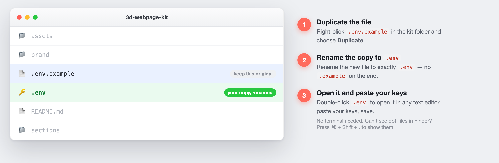

# Setup

This kit runs inside **Claude Code**. There are two levels — start at Level 1, add Level 2 when you want the animated 3D hero.

---

## Level 1 — Build & deploy pages (minimal setup)

You can design, edit, and ship pages with almost nothing installed.

1. **Open the folder in Claude Code.** `cd 3d-webpage-kit && claude`
2. **Build a page:** ask Claude to build one — it follows `CLAUDE.md` and composes from `sections/` using your `brand/tokens.css`. Preview locally: `python3 -m http.server 8000`.
3. **Deploy (Cloudflare):** create a free Cloudflare account, then a token at
   <https://dash.cloudflare.com/profile/api-tokens> → *Create Token* → **Edit Cloudflare Workers**.
   Make your `.env`: in the kit folder, **duplicate `.env.example` and rename the copy to
   `.env`** (no terminal needed — right-click → Duplicate, then rename). Open it and fill in
   `CLOUDFLARE_API_TOKEN` and `CLOUDFLARE_ACCOUNT_ID` (Account ID is on the Cloudflare
   dashboard). Save. Then just tell Claude **"deploy this"** (it runs `npx wrangler deploy`).

   

   > Prefer the terminal? `cp .env.example .env` does the same thing.
   > **Can't see `.env` in Finder?** Dot-files are hidden by macOS — press **Cmd + Shift + . (period)** to reveal them.
   > Prefer another host? The output is plain static files — Netlify, Vercel, and GitHub Pages all work.

That's it for regular pages. No AI keys needed.
*(You already have Node — it comes with Claude Code — so `npx wrangler` just works.)*

---

## Level 2 — The AI 3D product hero (scroll-hero)

The scroll-scrubbed 3D hero (see `pages/example-airpods.html`) is generated by AI. It needs a kie.ai key and three local tools.

1. **kie.ai key** — sign up at <https://kie.ai>, Dashboard → API Keys. Paste it into `.env` as `KIE_API_KEY`.
   The kit talks to kie through `scripts/kie.sh` (a small REST wrapper) — **no MCP setup required.**
2. **Local tools** (for slicing + background removal):
   ```bash
   brew install ffmpeg webp        # macOS  (Linux: apt install ffmpeg webp)
   pip install rembg               # or: pipx install rembg
   ```
3. **Run it:** ask Claude to "build a scroll hero for <your product>". It runs the `scroll-hero`
   skill — storyboards it, generates the frames, mattes them, and wires the section. It will
   confirm costs before spending (image stills are cheap; the video is the main cost).

### Optional — Level 2+ : the kie MCP (power users)
If you'd rather have **all** kie tools available to Claude Code across every project (not just this
kit), you can install the kie MCP server instead of the wrapper. That's a heavier, one-time setup
(clone the server, add it to `~/.claude.json` `mcpServers`, restart Claude Code). The wrapper above
is all this kit needs — only reach for the MCP if you want kie everywhere.

---

## Keys, safely
- Your real `.env` is git-ignored — never commit it.
- Keys live only in `.env` on your machine; the kit never sends them anywhere except kie/Cloudflare.
